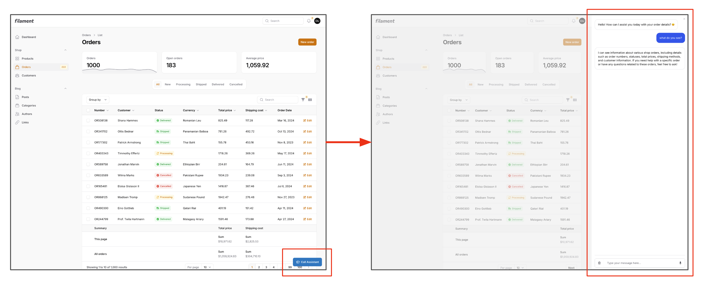
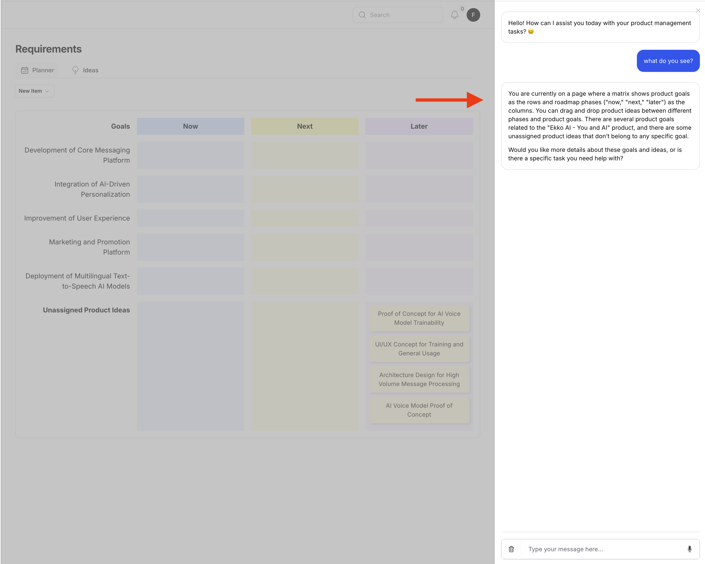
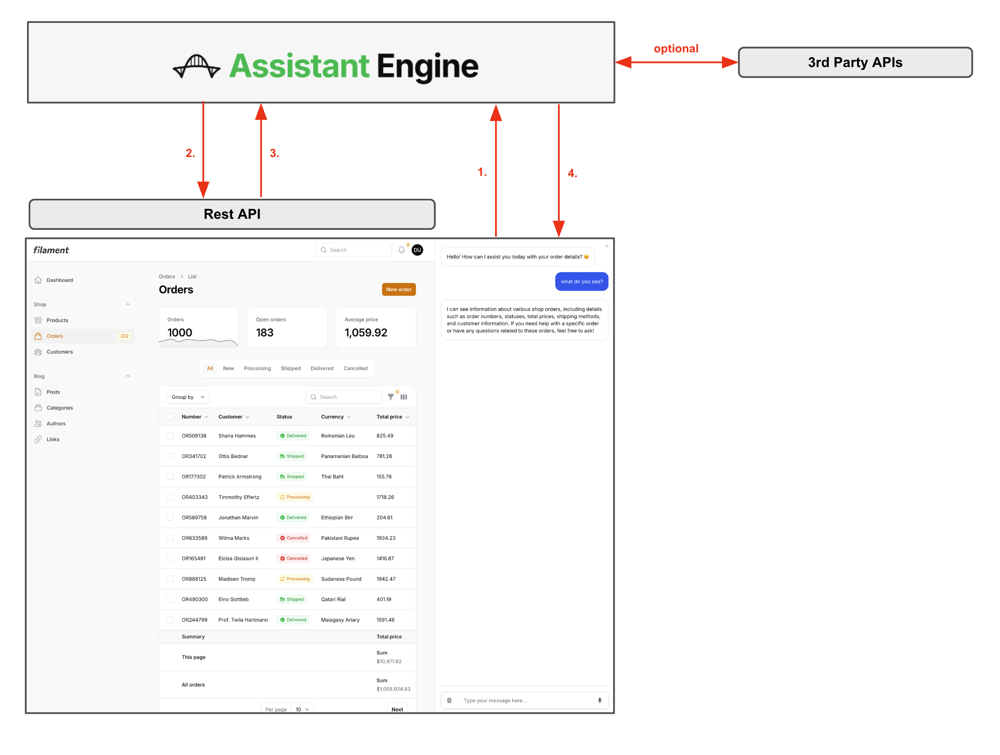
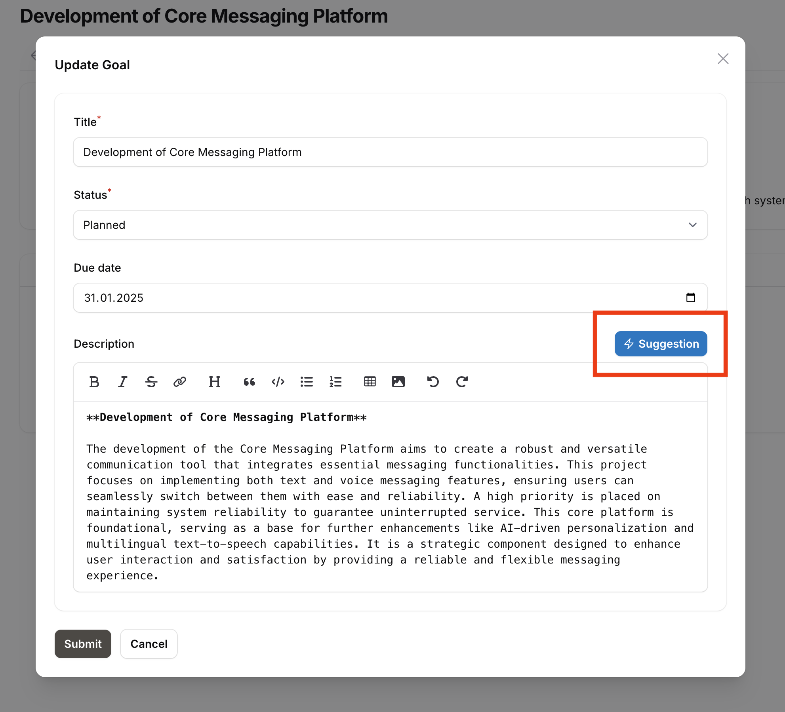

# Assistant Engine for Filament

The [Assistant Engine](https://www.assistant-engine.com/) for Filament makes it easy to add conversational AI capabilities directly into Laravel Filament projects. It includes a chat sidebar, context resolver, connection to 3rd party tools and the possibility to create interactive buttons that enhance user interaction by offering AI support within the Filament panel.

## Requirements

- **PHP**: 8.2 or higher
- **Composer**
- **Filament**: (See [Filament Installation Guide](https://filamentphp.com/docs/3.x/panels/installation))
- **Filament Custom Theme**: (See [Installation Guide](https://filamentphp.com/docs/3.x/panels/themes#creating-a-custom-theme))
- **OpenAI API Key**: (See [OpenAI Documentation](https://platform.openai.com/docs/api-reference/authentication))
- **Assistant Engine API Key**: (See [Assistant Engine Documentation](https://docs.assistant-engine.com/docs/projects#api-key))

> **Important Notice**: Both an OpenAI API key and an Assistant Engine API key are required to use this package. Ensure these keys are configured correctly by following the respective documentation linked above.

## Documentation

The official documentation for the Assistant Engine can be found [here](https://docs.assistant-engine.com/docs). Learn more about assistants, tasks, tools, and how to connect other third-party APIs.

## Installation

You can install the Assistant Engine for Filament via Composer:

```bash
composer require assistant-engine/filament-assistant
```

Then, publish the configuration file using the command below:

```bash
php artisan vendor:publish --tag=filament-assistant-config
```

After installing the plugin, follow the instructions to create a [custom theme](https://filamentphp.com/docs/3.x/panels/themes#creating-a-custom-theme) and add the following lines to your new theme's `tailwind.config.js`:

```typescript
// resources/css/filament/admin(theme name)/tailwind.config.js
export default {
    content: [
        './vendor/assistant-engine/filament-assistant/resources/**/*.blade.php',
    ]
};
```

As well as enabling the plugin within your panel:

```php
use AssistantEngine\Filament\FilamentAssistantPlugin;

class YourPanelProvider extends PanelProvider
{
    public function panel(Panel $panel): Panel
    {
        return $panel
            ->plugin(FilamentAssistantPlugin::make());

    }
}
```

Run the following command for development:

```bash
npm run dev
```

## Configuration

After publishing the configuration, you can find it in `config/assistant-engine.php`. Customize it to set your API keys and other settings.

The **chat** configuration section is identical to the description provided in the [Laravel Assistant repository](https://github.com/AssistantEngine/laravel-assistant). Refer to it for more detailed information.

```php
return [
    'api-url' => env('ASSISTANT_ENGINE_API', 'https://api.assistant-engine.com/v1/'),
    'api-key' => env('ASSISTANT_ENGINE_TOKEN'),
    'llm-provider-key' => env('OPENAI_API_KEY'),

    "chat" => [
        "render-assistant-message-as-markdown" => true,

        "disable-assistant-icon" => false,
        "disable-user-input" => false,

        "open-ai-recorder" => [
            "activate" => true,
            "open-ai-key" => env('OPENAI_API_KEY'),
            "language" => "en"
        ]
    ],
    'filament-assistant' => [
        'button' => [
            'show' => true,
            'options' => [
                'label' => 'Assistant',
                'size' => \Filament\Support\Enums\ActionSize::ExtraLarge,
                'color' => \Filament\Support\Colors\Color::Sky,
                'icon' => 'heroicon-o-chat-bubble-bottom-center-text'
            ]
        ],

        'conversation-option' => [
            'assistant-key' => env('ASSISTANT_ENGINE_ASSISTANT_KEY'),
            'conversation-resolver' => \AssistantEngine\Filament\Resolvers\ConversationOptionResolver::class,
            'context-resolver' => \AssistantEngine\Filament\Resolvers\ContextResolver::class
        ],

        'sidebar' => [
            'render' => true,
            'width' => 500,
            'show-without-trigger' => false
        ],
    ]
];
```

### Configuration Fields Description

#### Filament Assistant Configuration

- **button**: Controls whether the assistant button is shown in the bottom right corner.
    - **show**: Boolean that determines if the assistant button is displayed.
    - **options**: Customization options for the button.
        - **label**: The label text displayed on the button.
        - **size**: The size of the button, e.g., `ExtraLarge`.
        - **color**: The color of the button, e.g., `Sky`.
        - **icon**: The icon displayed on the button.

- **conversation-option**: Configures conversation behavior.
    - **assistant-key**: The key for the assistant, which the user must create in the Assistant Engine.
    - **conversation-resolver**: Class responsible for resolving the conversation option based on defined rules.
    - **context-resolver**: Resolves context models automatically.

- **sidebar**: Configures the sidebar that displays the assistant conversation.
    - **render**: Boolean that controls whether the sidebar is rendered.
    - **width**: The width of the sidebar in pixels.
    - **show-without-trigger**: Boolean that controls whether the sidebar is automatically shown when a conversation option is available.

## Example `.env` File

Add the following environment variables to your `.env` file to configure the Assistant Engine:

```
ASSISTANT_ENGINE_API=https://api.assistant-engine.com/v1/
ASSISTANT_ENGINE_TOKEN=your_assistant_engine_api_key
ASSISTANT_ENGINE_ASSISTANT_KEY=your_default_assistant_key
OPENAI_API_KEY=your_openai_api_key
```

## Usage

After you installed the plugin and logged into your filament panel you will have the assistant button available at the bottom of the page:



### Conversation Option Resolver

The **Conversation Option Resolver** is used to determine which conversation option should be used when initializing the assistant. It allows you to implement custom logic based on the current page or other factors to control whether an assistant should be displayed and how it should behave.

You can create a custom conversation option resolver by implementing the `ConversationOptionResolverInterface`. This gives you complete control over the behavior, including the ability to determine whether to return a conversation option or not. If you return `null`, no conversation or assistant will be shown on the page.

Example of the built-in Conversation Option Resolver:

```php
<?php

namespace AssistantEngine\Filament\Resolvers;

use AssistantEngine\Filament\Contracts\ConversationOptionResolverInterface;
use AssistantEngine\SDK\Models\Options\ConversationOption;
use Filament\Pages\Page;

class ConversationOptionResolver implements ConversationOptionResolverInterface
{
    public function resolve(Page $page): ?ConversationOption
    {
        $assistantKey = config('assistant-engine.filament-assistant.conversation-option.assistant-key');

        if (!$assistantKey) {
            throw new \Exception('assistant-key must be set');
        }

        $option = new ConversationOption($assistantKey, [
            'user_id' => auth()->check() ? auth()->user()->id : null
        ]);

        return $option;
    }
}
```

You can also customize the resolver logic to adapt to different pages or user roles, providing a tailored conversational experience by extending the built-in ConversationOptionResolver or implement the interface on your own.

### ConversationOption Object

The `ConversationOption` object allows you to configure how a conversation is created or retrieved. The available fields include:

```php
use AssistantEngine\SDK\Models\Options\ConversationOption;

// Create a new ConversationOption
$options = new ConversationOption('assistant_key', [
    'user_id' => 'user123',
    'subject_id' => 'subject456',
    'title' => 'New Conversation',
    'context' => ['topic' => 'tech support'],
    'additional_data' => ['foo' => 'bar'],
    'recreate' => true,
]);
```

- **assistant_key** (required): Unique key identifying the assistant.
- **user_id** (optional): ID of the user associated with the conversation, allowing multiple users to have different conversations with the same assistant.
- **subject_id** (optional): ID of a specific subject, enabling a user to have separate conversations with the assistant about different topics.
- **title** (optional): Title of the conversation, used solely for client purposes.
- **context** (optional): Arbitrary data to provide context to the conversation. This context is included with the conversation data sent to the LLM.
- **additional_data** (optional): Data intended for the front-end or client application, allowing additional operations based on its content.
- **recreate** (optional): If set to true, recreates the conversation, deactivating the previous one.

> Note: The Assistant Engine will attempt to locate an existing conversation based on the combination of `assistant_key`, `user_id`, and `subject_id`. If a match is found, that conversation will be retrieved; otherwise, a new one will be created.

### Context Resolver

The **Context Resolver** is responsible for resolving context models that are visible on the page and providing them to the assistant. This helps the assistant understand the context of the current page and allows it to access relevant information during the conversation.


The default **Context Resolver** (`ContextResolver`) tries to collect models related to the page, such as records or list items, and injects them into the context of the `ConversationOption` object.

Example of a Context Resolver:

```php
<?php

namespace AssistantEngine\Filament\Resolvers;

use AssistantEngine\Filament\Contracts\ContextResolverInterface;
use Filament\Pages\Page;
use Filament\Resources\Pages\ListRecords;
use Filament\Resources\Pages\ManageRelatedRecords;
use Filament\Resources\RelationManagers\RelationManager;

class ContextResolver implements ContextResolverInterface
{
    public function resolve(Page $page): array
    {
        $result = [];

        // Collect models directly related to the page's record
        if (isset($page->record)) {
            $this->collectFromRecord($result, $page->record);
        }

        // Collect models for ListRecords page
        if ($page instanceof ListRecords) {
            $this->collectFromListRecordsPage($result, $page);
        }

        // Collect models for ManageRelatedRecords page
        if ($page instanceof ManageRelatedRecords) {
            $this->collectFromManageRelatedRecordsPage($result, $page);
        }

        // Collect models from relation managers
        if (method_exists($page, "getRelationManagers") && !empty($page->getRelationManagers())) {
            $this->collectFromRelationManagers($result, $page);
        }

        return $this->resolveCollectedModels($result);
    }
}
```

The **Context Resolver** automatically gathers information about the page and its related models, enabling the assistant to leverage this information during a conversation.

### Custom Context Resolvers

Sometimes you have pages which are fully custom, and where the standard Context Resolver doesn't get all the models visible to the customer. In this case, you can either implement your own Context Resolver based on the interface, or you can extend it, like in the example below, to add more context. You can extend the Context Resolver and, based on different pages, inject other contexts, like models or the description of the page, to give the LLM even more context about what the user is seeing right now.



Example of a Custom Context Resolver:

```php
<?php

namespace App\Modules\Assistant\Resolvers;

use App\Filament\Resources\ProductResource\Pages\Ideas\IdeaPlanner;
use App\Modules\Product\Models\ProductGoal;
use App\Modules\Product\Models\ProductIdea;
use Filament\Pages\Page;

class ContextResolver extends \AssistantEngine\Filament\Resolvers\ContextResolver
{
    public function resolve(Page $page): array
    {
        $context = parent::resolve($page);

        return match (get_class($page)) {
            IdeaPlanner::class => $this->handleIdeaPlannerPage($page, $context),
            default => $context
        };
    }

    protected function handleIdeaPlannerPage(IdeaPlanner $page, array $context): array
    {
        $context['pageDescription'] = "This page shows a matrix where product goals are the rows and the roadmap phases (now, next, later)"
        . " are the columns. The user can drag and drop the product ideas between different phases and product goals"
        . " The Ideas you find in the context which don't belong to a goal are unassigned";

        $context = array_merge_recursive($context, $this->resolveModels(ProductGoal::class, $page->goals->all()));

        return array_merge_recursive($context, $this->resolveModels(ProductIdea::class, $page->ideas->all()));
    }
}
```

### Custom Model Serialization

The standard resolving mechanism for models is to transform them to arrays. But sometimes you want to have a different model serialization. Maybe you want to hide properties or give the LLM a little bit more context regarding the models it sees. Therefore, another interface exists called **Context Model Interface**, which defines a static function `resolveModels` that you can implement and use to resolve a list of models of the same type.


```php
<?php

namespace AssistantEngine\Filament\Contracts;

use Filament\Pages\Page;

interface ContextModelInterface
{
    public static function resolveModels(array $models): array;
}
```

There is also a trait implementing this interface called **Context Model**, where you can group models from the same class inside a data object and provide the LLM with metadata as well as exclude properties from the model itself. This ensures that sensitive data is not sent to the LLM directly, but you can adjust it to your needs.

```php
<?php

namespace AssistantEngine\Filament\Traits;

use AssistantEngine\Filament\Resolvers\ContextModelResolver;

trait ContextModel
{
    public static function getContextMetaData(): array
    {
        return [
            'schema' => self::class
        ];
    }

    public static function getContextExcludes(): array
    {
        return [];
    }

    public static function resolveModels(array $models): array
    {
        $result = [];
        $result['data'] = null;

        if (count($models) > 0) {
            $result['data'] = ContextModelResolver::collection($models)->resolve();
        }

        $result['meta'] = self::getContextMetaData();

        return $result;
    }
}
```

This Trait you can implement in your Model Classes and overwrite the defined methods if needed:

```php
namespace AssistantEngine\Filament\Contracts\ContextModelInterface;

#[Schema(
    schema: "Product",
    properties: [
        new Property(property: "id", type: "integer"),
        new Property(property: "title", type: "string"),
        new Property(property: "description", type: "string"),
        new Property(property: "created_at", type: "string", format: "date-time"),
        new Property(property: "updated_at", type: "string", format: "date-time"),
    ]
)]
class Product extends Model implements ContextModelInterface
{
    use ContextModel;

    protected $fillable = ['title', 'description', 'integration_settings', 'assistant_overwrites'];

    public static function getContextExcludes(): array
    {
        return ['integration_settings'];
    }

    public static function getContextMetaData(): array
    {
        return ['schema' => 'Product'];
    }
}
```

### Tool Calling

Of course, there's also the flow backwards from the chat to your application, so that the assistant can access your application. All you need to do is expose an API, which can be defined or described by an OpenAPI schema, and create within the Assistant Engine a new tool, and connect your assistant to the tool. Then, the assistant can perform operations on this API (eg. CRUD).



After the message is processed, the page component automatically refreshes so that you can see what the assistant updated for you. If you want, you can also manually listen to the event; just implement a listener on ```ChatComponent::EVENT_RUN_FINISHED``` and then you can process your custom logic.

```php
#[On(ChatComponent::EVENT_RUN_FINISHED)]
public function onRunFinished()
{
    // Handle run finished event
}
```

You can also connect your assistant to other APIs and let the assistant perform tasks for you in other systems or third-party systems, which are also connected to the assistant with the tool. You can learn more about tool usage in the official documentation. You can also connect your local APIs via a tunnel, such as ngrok, to the Assistant Engine and work locally without the need of deploying an api.

### Creating Buttons to Trigger an AI Task

You can also trigger an AI task with a Filament action. For example, if you want to generate a suggestion within a form, you can inject the `AssistantEngine` object directly and then trigger a task. It could be something like provide a suggestion, rework a text, or make sth. more concise — whatever task you have in mind. A task can also leverage tools.



Example:

```php
MarkdownEditor::make('description')
    ->hintActions([
        Action::make('suggestion')
            ->button()
            ->action(function (AssistantEngine $engine, Set $set, Get $get) use ($goals) {
                $title = $get('title');

                if (!$title) {
                    Notification::make()
                        ->title('At least a title must be set')
                        ->danger()
                        ->send();

                    return;
                }

                $taskOptions = new TaskRunOption([
                    'title' => $title,
                    'object' => 'Product Goal',
                    'existing_goals' => $goals->toArray()
                ]);

                $output = $engine->initiateTaskRunAndPoll(env("ASSISTANT_ENGINE_TASK_SUGGESTION_TEXT"), $taskOptions);

                $set('description', $output->output);
            })
            ->icon('heroicon-o-bolt')
            ->color(Color::Sky),
    ])
    ->maxLength(65535)
    ->columnSpanFull();
```

This example demonstrates how you can provide an action to trigger an AI task, which interacts directly with the assistant engine to perform an operation based on the form data and return the result for further processing or to suggest updates directly to the user.

## One More Thing

We’ve created more repositories to make working with the Assistant Engine even easier! Check them out:

- **[PHP SDK](https://github.com/AssistantEngine/php-sdk)**: The PHP SDK provides a convenient way to interact with the Assistant Engine API, allowing developers to create and manage conversations, tasks, and messages.
- **[Laravel Assistant](https://github.com/AssistantEngine/laravel-assistant)**: The Laravel integration for adding conversational AI capabilities in your Laravel applications.

> We are a young startup aiming to make it easy for developers to add AI to their applications. We welcome feedback, questions, comments, and contributions. Feel free to contact us at [contact@assistant-engine.com](mailto:contact@assistant-engine.com).

## Contributing

We welcome contributions from the community! Feel free to submit pull requests, open issues, and help us improve the package.

## License

This project is licensed under the MIT License. Please see [License File](LICENSE.md) for more information.
